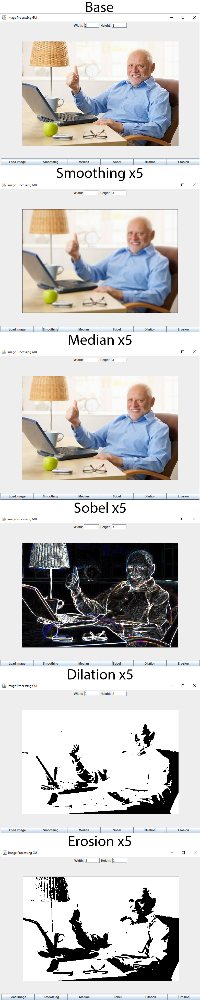

### Introduction
This project illustrates the effects of 5 conventional image filters with a few variables, 2 of them being modifiable through the UI.
Filters included: Smoothing, Median, Sobel, Dilation and Erosion.

